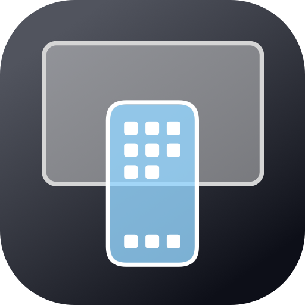
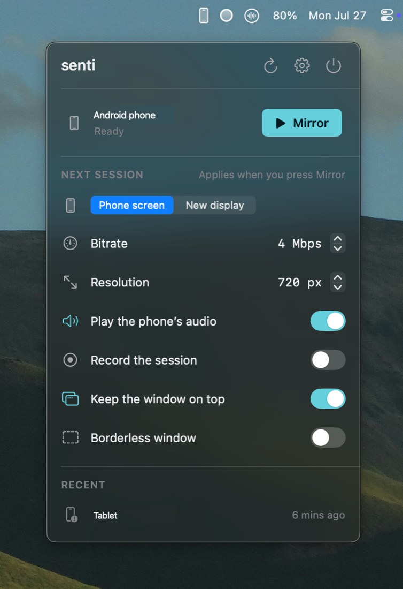
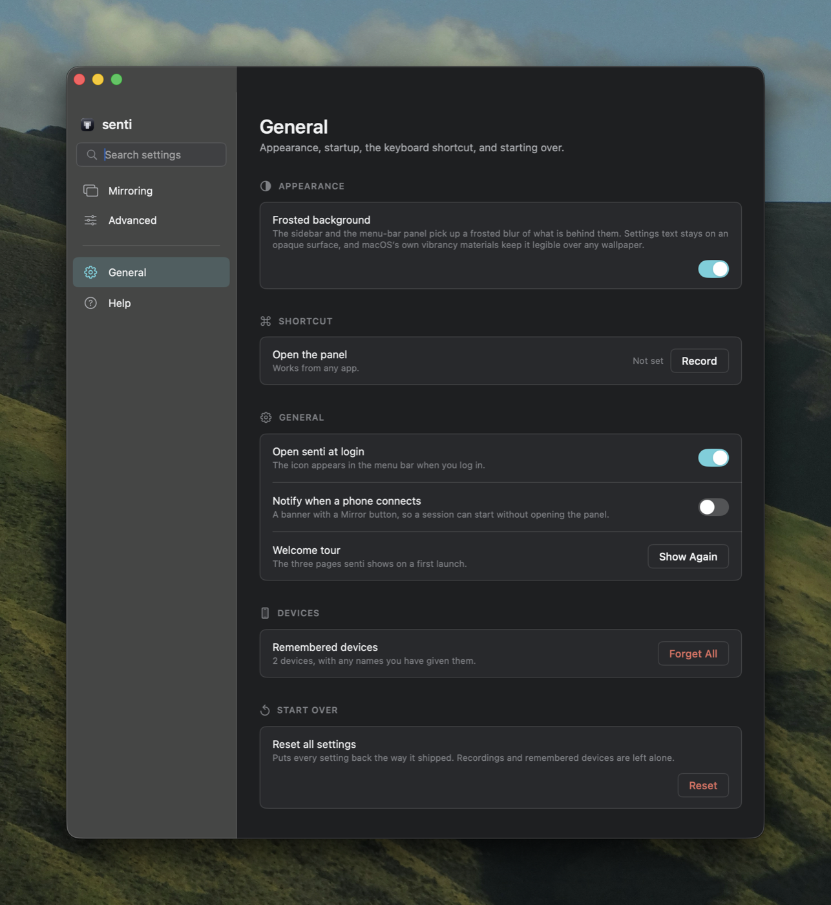

<p align="center">
  
</p>

<h1 align="center">senti</h1>

<p align="center">
  Mirror an Android phone on the Mac, over USB. Plug the phone in, click the menu-bar<br>
  icon, press Mirror — no Terminal, no Homebrew, nothing to install.
</p>

<p align="center">
  <a href="https://github.com/smrazar/senti/releases/latest">Download</a> ·
  <a href="docs/STATUS.md">Status</a> ·
  <a href="docs/CHANGELOG.md">Changelog</a> ·
  <a href="docs/BUGS.md">Bugs</a>
</p>

<p align="center">
  
</p>

[scrcpy](https://github.com/Genymobile/scrcpy) and adb ship inside the app and unpack themselves
on first launch.

## What it does

- One-click mirroring of any USB-connected Android phone
- Picture and sound settings that read like sentences, not flags
- Record a session to mp4 or mkv, with the recent files listed
- Remembers phones, and lets you rename them
- A banner when a phone is plugged in, with a Mirror button on it
- Optional: start mirroring automatically when a particular phone connects
- A global keyboard shortcut that opens the panel from anywhere
- Full light and dark

Settings are four panes, not forty. The background is one switch: the sidebar and the menu-bar
panel blur what is behind them, while settings text stays on an opaque surface so it reads over
any wallpaper.

<p align="center">
  
</p>

## Requirements

- macOS 15 or later, Apple Silicon
- An Android phone with USB debugging turned on (Settings → Help explains how)
- A USB cable that carries data

## Build and install

```sh
./package-app.sh          # builds build/senti.app
./install.sh              # installs to /Applications and launches
./install.sh --fresh      # same, but wipes all state first
```

`--fresh` before any handover build. Leftover state hides bugs.

Run the self-checks without launching the app:

```sh
swift build && ./.build/debug/Senti --self-check
```

## How it works

senti is a shell around scrcpy. On first launch it unpacks the bundled scrcpy + adb build into
`~/Library/Application Support/senti/`, polls `adb devices -l` for phones, and spawns one scrcpy
process per mirror session. scrcpy owns its window and does all the work that has to be fast;
senti hands it the right settings and stays out of the way.

State lives in two places: `com.local.senti` in UserDefaults (settings and device names), and
`~/Movies/senti/` (recordings).

## Credits

- **[scrcpy](https://github.com/Genymobile/scrcpy)** by Genymobile — the mirroring engine.
  Apache License 2.0, bundled unmodified.
- **Android platform tools** — adb.

## Licence

GPL-3.0. The bundled scrcpy binary stays Apache 2.0; the two are compatible.
